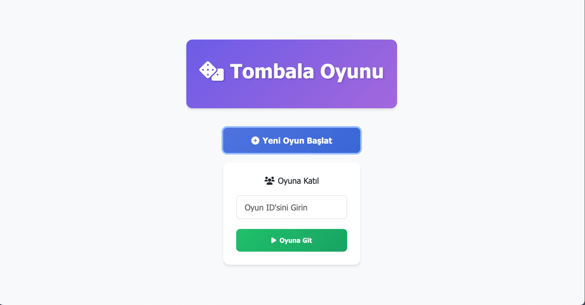
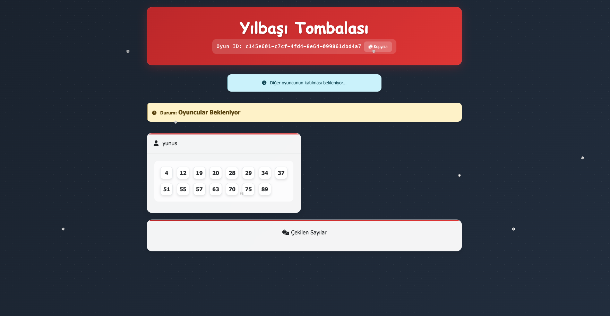
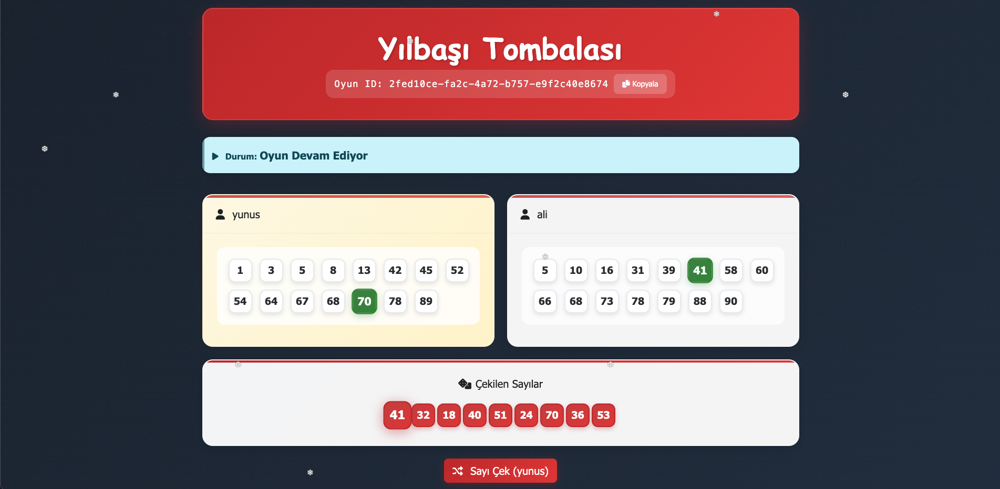

# Yılbaşı Tombalası 🎄

Bu proje arkadaşlarınızla veya ailenizle oynayabileceğiniz yılbaşı temalı iki kişilik basit bir tombala oyunudur.

## 📸 Ekran Görüntüleri

### Ana Sayfa

*Oyun kurmak veya katılmak için giriş ekranı*

### Oyun Başlangıcı

*Diğer oyuncunun katılmasını bekleme ekranı*

### Oyun Devam Ediyor

*Aktif oyun ekranı - Sıra sistemi ve çekilen sayılar*

### Oyun Sonu

*Oyun sonu ekranı - Çinko ve Tombala durumları*

## 🎯 Özellikler

- Gerçek zamanlı oyun deneyimi
- 2 oyunculu sistem
- Yılbaşı temalı tasarım
- Otomatik çinko ve tombala kontrolü
- Anlık bildirimler

## 🛠️ Teknolojiler

- **Backend:**
  - Spring Boot
  - WebSocket (STOMP)
  - Java 17
  - Maven

- **Frontend:**
  - Thymeleaf
  - Bootstrap 5
  - HTML5/CSS3
  - JavaScript
  - SockJS
  - STOMP.js

## 🚀 Kurulum

1. Projeyi klonlayın:
```bash
git clone https://github.com/yunusemrenalbant/tombala.git
```

2. Proje dizinine gidin:
```bash
cd tombala
```

3. Maven ile projeyi derleyin:
```bash
mvn clean install
```

4. Uygulamayı başlatın:
```bash
mvn spring-boot:run
```

5. Tarayıcınızda şu adresi açın:
```
http://localhost:8080
```

## 🎮 Nasıl Oynanır?

1. Ana sayfada "Yeni Oyun" butonuna tıklayın
2. Oluşturulan oyun ID'sini arkadaşınızla paylaşın
3. Her oyuncu kendi adını girerek oyuna katılır
4. İlk oyuncu otomatik olarak seçilir ve oyun başlar
5. Sırası gelen oyuncu "Sayı Çek" butonuna tıklayarak bir sayı çeker
6. Çekilen sayı karttaki sayılardan biriyle eşleşirse otomatik işaretlenir
7. 5 sayı işaretlendiğinde çinko yapılır
8. Tüm sayılar işaretlendiğinde tombala yapılır ve oyun biter

## 🎯 Oyun Kuralları

- Her oyuncuya 15 sayıdan oluşan birer kart verilir
- Sayılar 1-90 arasından rastgele seçilir
- Oyuncular sırayla sayı çeker
- İlk 5 sayıyı tamamlayan çinko yapar
- Tüm sayıları tamamlayan tombala yapar ve oyunu kazanır
